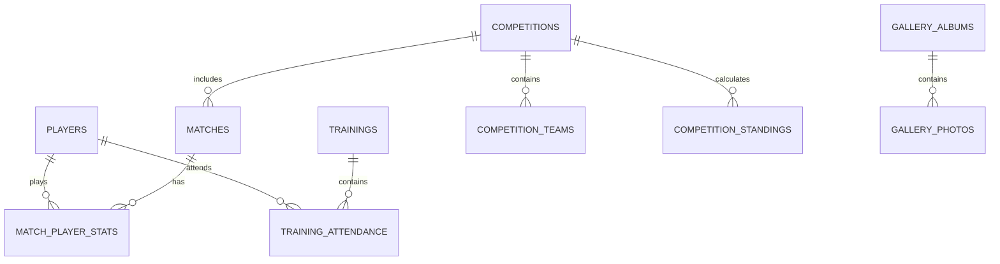

# Entity Relationship Diagram (ERD)

> Database Relationships  
> Version: 1.0  
> Last updated: July 2026

---

# 1. Загальна інформація

Entity Relationship Diagram (ERD) показує логічну структуру бази даних та взаємозв'язки між основними сутностями системи.

База даних побудована за принципом нормалізації та використовує зовнішні ключі (Foreign Keys) для забезпечення цілісності даних.

---

# 2. Основні модулі бази даних

Система складається з наступних логічних модулів:

- Players
- Trainings
- Attendance
- Matches
- Competitions
- Statistics
- News
- Gallery
- Push Notifications
- System Settings

---

# 3. Загальна ER Diagram



---

# 4. Опис зв'язків

## Players → Training Attendance

Тип:

**One-to-Many (1:N)**

Один гравець може бути присутнім на багатьох тренуваннях.

---

## Trainings → Training Attendance

Тип:

**One-to-Many (1:N)**

Одне тренування містить записи відвідуваності всіх гравців.

---

## Players → Match Player Statistics

Тип:

**One-to-Many (1:N)**

Один гравець може брати участь у багатьох матчах.

---

## Matches → Match Player Statistics

Тип:

**One-to-Many (1:N)**

Для кожного матчу ведеться окрема статистика гравців.

---

## Competitions → Matches

Тип:

**One-to-Many (1:N)**

Кожне змагання включає декілька матчів.

---

## Competitions → Competition Teams

Тип:

**One-to-Many (1:N)**

До одного турніру може входити багато команд.

---

## Competitions → Competition Standings

Тип:

**One-to-Many (1:N)**

Для кожного турніру автоматично формується турнірна таблиця.

---

## Gallery Albums → Gallery Photos

Тип:

**One-to-Many (1:N)**

Один фотоальбом містить багато фотографій.

---

# 5. Незалежні сутності

Деякі таблиці не мають прямих зв'язків з іншими сутностями.

До них належать:

- News
- Push Subscriptions
- Player Statistics
- Seasons
- Settings

Вони використовуються окремими функціональними модулями системи.

---

# 6. Логічна схема модулів

```text
Players
        │
        ▼
Attendance

Players
        │
        ▼
Match Statistics
        │
        ▼
Matches
        │
        ▼
Competitions
        │
        ▼
Standings

News
        │
        ▼
Public Website

Gallery
        │
        ▼
Public Website

Push Subscriptions
        │
        ▼
Push Notifications
```

---

# 7. Принципи побудови

При проектуванні бази даних використовувались:

- Foreign Keys;
- нормалізація даних;
- мінімізація дублювання;
- модульна структура;
- масштабованість;
- підтримка автоматичних SQL Functions;
- підтримка Database Triggers.

---

# 8. Поточний стан

ER Diagram відповідає Production-базі даних.

Структура містить:

- 15 таблиць;
- 20 Foreign Keys;
- 15 Primary Keys;
- 11 SQL Functions;
- 15 Database Triggers.

Архітектура готова до подальшого розширення без зміни існуючих зв'язків.

---

## Історія змін

| Версія | Дата        | Зміни             |
| ------ | ----------- | ----------------- |
| 1.0    | Липень 2026 | Створено документ |
